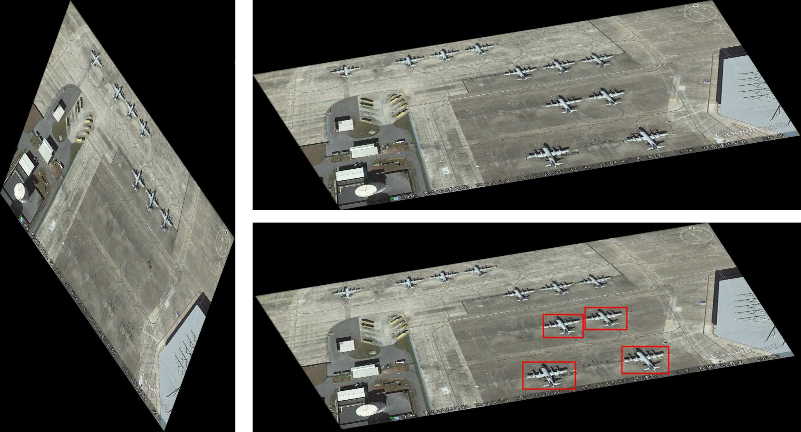

# View-angle invariant object monitoring without image registration
This is the official implementation of ***ViOM*** (ICASSP 2020), an object-specific change detection approach. For more details, please refer to:

**View-angle invariant object monitoring without image registration [[Paper]](https://ieeexplore.ieee.org/abstract/document/9054668/)**  <br />
Xin Zhang, Chunlei Huo, Chunhong Pan<br />



## Get Started 
## Preparation
Clone the code
```
git clone https://github.com/XinZhangNLPR/ICASSP2022_ViOM.git
```

Download the model weight used in the paper to /models/res101/pascal_voc/:

* [RFCN-resnet101](https://drive.google.com/file/d/1goliEY6yTQnKENaDcsotWpsxXfMnGiif/view?usp=sharing)

### Installation

* Python 2.7 or 3.6
* Pytorch 0.4.0 (**now it does not support 0.4.1 or higher**)
* CUDA 8.0 or higher

### Pretrained Model (If you want to train the model by yourself)

We used ResNet101 in our experiments. You can download the pretrain model from:

* ResNet101: [Dropbox](https://www.dropbox.com/s/iev3tkbz5wyyuz9/resnet101_caffe.pth?dl=0), [VT Server](https://filebox.ece.vt.edu/~jw2yang/faster-rcnn/pretrained-base-models/resnet101_caffe.pth)

Download them and put them into the data/pretrained_model/.

### Compilation

As pointed out by [ruotianluo/pytorch-faster-rcnn](https://github.com/ruotianluo/pytorch-faster-rcnn), choose the right `-arch` in `make.sh` file, to compile the cuda code:

  | GPU model  | Architecture |
  | ------------- | ------------- |
  | TitanX (Maxwell/Pascal) | sm_52 |
  | GTX 960M | sm_50 |
  | GTX 1080 (Ti) | sm_61 |
  | Grid K520 (AWS g2.2xlarge) | sm_30 |
  | Tesla K80 (AWS p2.xlarge) | sm_37 |

More details about setting the architecture can be found [here](https://developer.nvidia.com/cuda-gpus) or [here](http://arnon.dk/matching-sm-architectures-arch-and-gencode-for-various-nvidia-cards/)

Install all the python dependencies using pip:
```
pip install -r requirements.txt
```

Compile the cuda dependencies using following simple commands:

```
cd lib
sh make.sh
```

It will compile all the modules you need, including NMS, ROI_Pooing, ROI_Align and ROI_Crop. The default version is compiled with Python 2.7, please compile by yourself if you are using a different python version.

**As pointed out in this [issue](https://github.com/jwyang/faster-rcnn.pytorch/issues/16), if you encounter some error during the compilation, you might miss to export the CUDA paths to your environment.**

## Train

Before training, set the right directory to save and load the trained models. Change the arguments "save_dir" and "load_dir" in trainval_net.py and test_net.py to adapt to your environment.

To train a faster R-CNN model with vgg16 on pascal_voc, simply run:
```
CUDA_VISIBLE_DEVICES=$GPU_ID python trainval_net.py \
                   --dataset pascal_voc --net vgg16 \
                   --bs $BATCH_SIZE --nw $WORKER_NUMBER \
                   --lr $LEARNING_RATE --lr_decay_step $DECAY_STEP \
                   --cuda
```
where 'bs' is the batch size with default 1. Alternatively, to train with resnet101 on pascal_voc, simple run:
```
 CUDA_VISIBLE_DEVICES=$GPU_ID python trainval_net.py \
                    --dataset pascal_voc --net res101 \
                    --bs $BATCH_SIZE --nw $WORKER_NUMBER \
                    --lr $LEARNING_RATE --lr_decay_step $DECAY_STEP \
                    --cuda
```
Above, BATCH_SIZE and WORKER_NUMBER can be set adaptively according to your GPU memory size. **On Titan Xp with 12G memory, it can be up to 4**.

If you have multiple (say 8) Titan Xp GPUs, then just use them all! Try:
```
python trainval_net.py --dataset pascal_voc --net vgg16 \
                       --bs 24 --nw 8 \
                       --lr $LEARNING_RATE --lr_decay_step $DECAY_STEP \
                       --cuda --mGPUs

```

Change dataset to "coco" or 'vg' if you want to train on COCO or Visual Genome.

## Test

If you want to evlauate the detection performance of a pre-trained vgg16 model on pascal_voc test set, simply run
```
python test_net.py --dataset pascal_voc --net vgg16 \
                   --checksession $SESSION --checkepoch $EPOCH --checkpoint $CHECKPOINT \
                   --cuda
```
Specify the specific model session, chechepoch and checkpoint, e.g., SESSION=1, EPOCH=6, CHECKPOINT=416.

## Demo

If you want to run detection on your own images with a pre-trained model, download the pretrained model listed in above tables or train your own models at first, then add images to folder $ROOT/images, and then run
```
python demo.py --net vgg16 \
               --checksession $SESSION --checkepoch $EPOCH --checkpoint $CHECKPOINT \
               --cuda --load_dir path/to/model/directoy
```

Then you will find the detection results in folder $ROOT/images.

## Citation
```
@INPROCEEDINGS{9054668,
  author={Zhang, Xin and Huo, Chunlei and Pan, Chunhong},
  booktitle={ICASSP 2020 - 2020 IEEE International Conference on Acoustics, Speech and Signal Processing (ICASSP)}, 
  title={View-Angle Invariant Object Monitoring Without Image Registration}, 
  year={2020},
  volume={},
  number={},
  pages={2283-2287},
  doi={10.1109/ICASSP40776.2020.9054668}}
```
